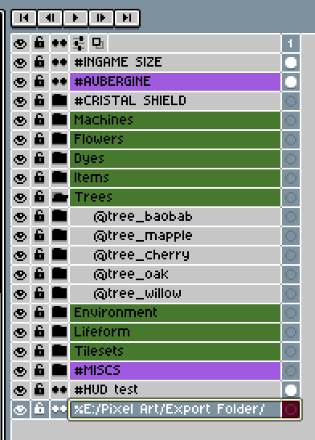
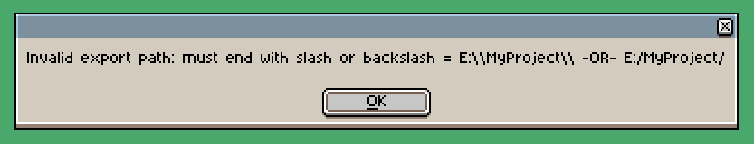
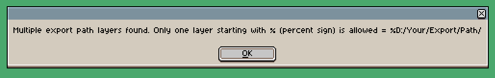
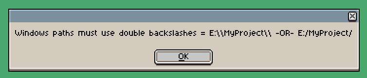

# Export By Group (Recursive)

A powerful and flexible Aseprite script to export your layers and groups intelligently. Designed by **Feel** ([https://www.instagram.com/feel.pixels/](https://www.instagram.com/feel.pixels/)) & ChatGPT, this script enables professional export workflows for artists working with layered sprites, dioramas, or modular elements.

---

## ✨ Features

- **Recursive export** of layers and groups
- ⚠️**Path from layer name**: export path is now defined by a special layer [see below](https://github.com/FeelPr/export-by-group-recursive/tree/main?tab=readme-ov-file#-define-the-export-folder-via-a-layer)⚠️
- **Trimmed PNGs**: crops empty pixels from exports
- **Group fusion**: export a whole group as one image using `@GroupName`
- **Visibility aware**: respects the "eye" icon in Aseprite
- **Ignore filter**: use `#` in a group/layer name to skip it
- **Export logs**: saved in `/Export-Logs/export-log.txt` for every session
- **No more script editing required** to change export folder

---

## 📁 Usage Rules

### 🔹 Export a group as a single image

Name the group with `@`:

```
@Tree_Maple
├── Trunk
├── Leafs
```

→ Will export as: `Tree_Maple.png`

### 🔹 Skip a group or layer entirely

Add a `#` in the name:

```
#WIP_Sketch
```

→ Completely ignored (even if visible)

### 🔹 Export visible layers individually

Any visible layer not inside a `@group` or containing `#` will be exported trimmed:

```
Layer: Sword_Blade → Sword_Blade.png
```

### 🔹 Define the export folder via a layer

Instead of editing the script, you now define the export root path directly inside your `.aseprite` file.

Just add a layer named with `%` followed by your desired export path:

```
%E:/MyGame/Exports/Characters/
```

🛑 **Important rules:**
- You must have **exactly one** `%layer`.
- The path must end with a slash `/` (or double-backslash `\` for Windows).
- If the path contains single backslashes (`\`), you **must double them** to avoid Lua errors.

✅ Correct:
```
%E:/MyGame/Exports/
%E:\\MyGame\\Exports\\
```

❌ Incorrect:
```
%E:\MyGame\Exports
```



---
Some 'security' check, no more dumb error.






---

### 🔧 How to install

1. Download the script from GitHub:  
👉 <a href="https://github.com/FeelPr/export-by-group-recursive" target="_blank">GitHub – Export By Group (Recursive)</a>

2. Place the `export-by-group-recursive.lua` file in your Aseprite scripts folder:
```
C:\Users\YourName\AppData\Roaming\Aseprite\scripts\
```

3. Run the script in Aseprite via:  
`File > Scripts > export-by-group-recursive.lua`

---

## 🔧 Requirements

- Aseprite (v1.3 or newer recommended)
- No manual editing of the script required

---

## 📜 License

This script is licensed under **Custom License inspired by BY-SA**.

- ✅ Free to use, modify and share
- ❌ Resale is **not** allowed
- 👤 Attribution required: [@feel.pixels](https://www.instagram.com/feel.pixels/) and ChatGPT

---

## 🧰 Credits

Crafted with 💛 by:

- 🎨 [Feel](https://www.instagram.com/feel.pixels/) (concept, testing, structure)
- 🤖 ChatGPT (Lua integration)

Feel free to share improvements or fork it with attribution.  
Keep crafting! 🚀
